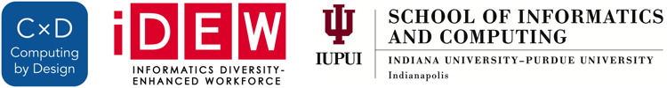

# Project Introduction

## Project Introduction


**UPDATE IN PROGRESS:** This new project guidebook will be a revised version of the [previous project guidebook](https://docs.idew.org/video-game/). Updates to this new guidebook will be occurring during summer 2019. All of the page links have been created within this new guidebook and should remain the same, even as the content is revised.




## Title

text



In this project, students will collaborate in small teams to design, develop, and evaluate their own technology solutions to an authentic challenge. Teams will follow a user-centered design approach which focuses on understanding the goals, needs, expectations, and experiences of the people that will use their technology solution. Evaluation and testing of ideas and prototypes is integrated throughout the design and development process.

This project is designed to follow the research-based “Gold Standard” model of Project Based Learning \(PBL\) developed by the [Buck Institute of Education](http://www.bie.org/about/what_pbl).

This project is intended to be completed throughout a semester-long high school CS course. Here are the estimated times required to complete each project phase:

| **Project Phase** | **Estimated Time** |
| :--- | :--- |
| 1 Discover & Define Problem | 6-7 weeks |
| 2 Design & Build Solution | 6-7 weeks |
| 3 Evaluate & Refine Solution | 2 weeks |
| 4 Share Project with Public | 1 weeks |

#### Assignment Templates

Some of the project assignments include links to Google Drive templates \(document, spreadsheet, slide presentation, drawing, etc.\). All the templates are shared as "**View Only**." Students must create a **copy** of the template in order to modify it. \(Students should **not** request edit access, as the file is a master template for all students.\)


**MAKE A COPY:**  To use a template, be sure you're logged in to your Google Account. From the template's **File** menu, select **Make a copy**. Save the copy to your shared team folder in Google Drive. You can now modify it.




This project reflects authentic principles and practices currently used in the technology industry. This project emphasizes design thinking, computational thinking, project management, and 21st century success skills \(such as creative thinking, critical thinking, communication, and collaboration\).



It is recommended that each student also complete one or more [research reports](https://docs.idew.org/research-topics-in-computing/) in parallel to this project. These research reports should be shared with the class \(and beyond\).



## Copyright and License

Copyright © 2016-2019 Michael Frontz and Jim Lyst, Indiana University School of Informatics and Computing at IUPUI

This material is part of the [Computing by Design](https://docs.idew.org/the-cxd-framework/) high school computer science curriculum developed for the [Informatics Diversity-Enhanced Workforce \(iDEW\)](http://soic.iupui.edu/idew/) program, an award-winning community partnership in central Indiana that is broadening student participation in computing and helping students develop the skills essential for success in the 21st century workplace. The iDEW program is managed by the [Indiana University School of Informatics and Computing at IUPUI](https://soic.iupui.edu/).

This work is licensed under a [Creative Commons Attribution-NonCommercial-ShareAlike 4.0 International License](http://creativecommons.org/licenses/by-nc-sa/4.0/). You are free to use, share, or adapt this material for noncommercial purposes as long as you provide proper attribution and distribute any copies or adaptations under this same license.

