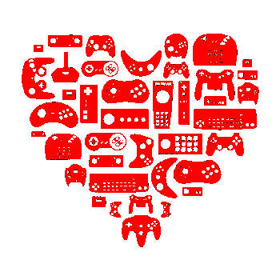

# Project Introduction

## Project Introduction


**UPDATE IN PROGRESS:** This new project guidebook is a revised version of the [previous project guidebook](https://docs.idew.org/video-game/). Updates to this new project guidebook will be completed during summer 2019. Assignments still in progress are identified.




## Game On

Ever since the earliest computers were built in the 1940s, people have been creating games to play on computers. In 1958, one of the first true video games — called "Tennis for Two" — was created using an oscilloscope \(which is a scientific device with a screen that's normally used to view electrical signals\). Special paddle inputs were built to play the game.

**VIDEO:** [Tennis for Two - one of the original video games](https://www.youtube.com/watch?v=6PG2mdU_i8k)

Up until the 1970s, computers were expensive, large-scale machines used primarily by governments, universities, and large corporations — so very few people were actually able to play these early computer games.

Then in the 1970s, the development of microprocessor chips allowed computers to become much smaller, less expensive, and easier to manufacture. As a result, coin-operated video arcade games \(such as [Pong](https://en.wikipedia.org/wiki/Pong), etc.\) were introduced into amusement arcades, restaurants, and other public places — quickly becoming a popular form of entertainment.

Soon after, the first personal computers \(such as the [Apple II](https://en.wikipedia.org/wiki/Apple_II), etc.\) and gaming consoles \(such as the [Atari 2600](https://en.wikipedia.org/wiki/Atari_2600), etc.\) became available to consumers, finally bringing video games into people's homes.

[Today, about 2.5 billion people across the world play video games](https://www.wepc.com/news/video-game-statistics/) — whether they play casual games or consider themselves serious gamers.

* What is it about video games that people like so much?
* What makes certain video games appeal to some people but not to others?
* How can you use a player-centered design process to create a game that people would want to play?




In this project, students will collaborate in small teams to research, design, develop, and evaluate their own technology solution to an authentic challenge. Teams will follow a user-centered design approach which focuses on understanding the goals, needs, expectations, and experiences of the people that will use their technology solution. Evaluation and testing of ideas and prototypes should be integrated throughout the design and development process.

This project has been designed to follow the research-based [“Gold Standard” model of Project Based Learning \(PBL\)](https://www.pblworks.org/what-is-pbl) developed by the Buck Institute of Education.

This project is intended to be completed throughout a semester-long high school CS course. Here are the estimated times required to complete each project phase:

| **Project Phase** | **Estimated Time** |
| :--- | :--- |
| 1 Discover & Define Problem | 6-7 weeks |
| 2 Design & Build Solution | 6-7 weeks |
| 3 Evaluate & Refine Solution | 2 weeks |
| 4 Share Project with Public | 1 week |

#### Assignment Templates

Some of the project assignments include links to Google Drive templates \(such as: document, spreadsheet, drawing, etc.\). These templates are shared as "**View Only**." Students must create a **copy** of the template in order to modify it. \(Students should **not** request edit access, as the file is a master template for all students.\)


**MAKE A COPY:**  To use a template, be sure you're logged in to your Google Account. From the template's **File** menu, select **Make a copy**. Save the copy to your shared team folder in Google Drive. You can now modify it.




This project reflects authentic principles and practices currently used in the technology industry. At a high level, this project emphasizes:

* Design Thinking
* Computational Thinking
* Project Management Skills
* 21st Century Success Skills, especially the 4Cs:  Creative Thinking, Critical Thinking, Communication, and Collaboration



It is recommended that each student also complete one or more [research reports](https://docs.idew.org/research-topics-in-computing/) in parallel to this project. These research reports should be shared with the class \(and beyond\). These research reports should focus on topics in computing, such as:

* Trends and Innovations in Computing
* Privacy and Ethics in Computing
* Degrees and Careers in Computing



## Copyright and License

Copyright © 2016-2019 Michael Frontz and Jim Lyst, Indiana University School of Informatics and Computing at IUPUI

This material is part of the [Computing by Design](https://docs.idew.org/the-cxd-framework/) high school computer science curriculum developed for the [Informatics Diversity-Enhanced Workforce \(iDEW\)](http://soic.iupui.edu/idew/) program, an award-winning community partnership in central Indiana that is broadening student participation in computing and helping students develop the skills essential for success in the 21st century workplace. The iDEW program is managed by the [Indiana University School of Informatics and Computing at IUPUI](https://soic.iupui.edu/).

This work is licensed under a [Creative Commons Attribution-NonCommercial-ShareAlike 4.0 International License](http://creativecommons.org/licenses/by-nc-sa/4.0/). You are free to use, share, or adapt this material for noncommercial purposes as long as you provide proper attribution and distribute any copies or adaptations under this same license.

