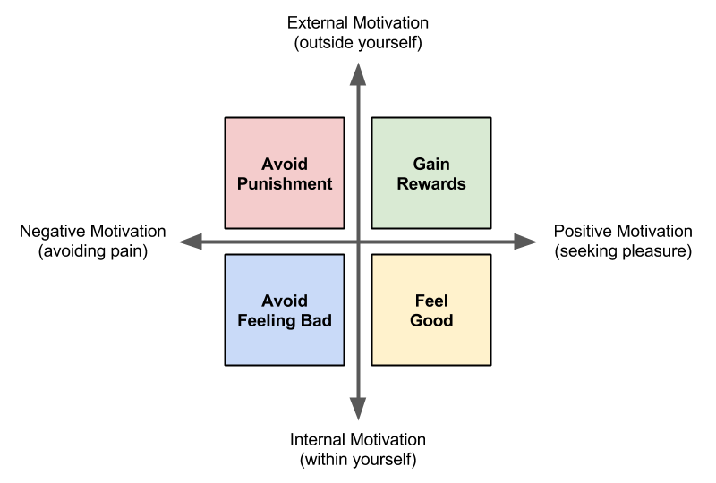

# 1.2 Incentives and Flow

TK

Brief exploration of psychology of motivation - what motivates people to perform certain behaviors?  Many theories. Many applications \(learning, work, etc.\).

In games, two commonly-used motivation theories are incentives \(rewards & punishments\) and flow. These can be applied in addition to the gamer motivations \(such as competition, etc.\).

Students will analyze use of incentives and flow in various games.

