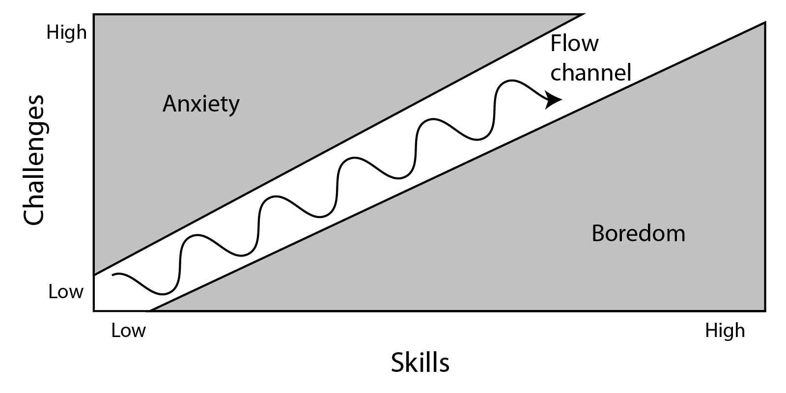

# 1.2 Incentives and Flow

TK - placeholder - in progress



Video game players are motivated by different types of gameplay. For example, some players are motivated to play games featuring challenge and competition, while other players might be motivated by games featuring story and strategy.

In addition to the type of gameplay, there are other motivational factors that can help keep players engaged in your game. We can use psychology research to understand factors that motivate people to perform behaviors \(whether playing a game, doing a task, learning something, etc.\).

Two possible ways to classify motivations include:

* **External vs. Internal** — External motivations originate outside ourselves, while internal motivations come from within ourselves.
* **Negative vs. Positive** — Negative motivations involve painful experiences, while positive motivations involve pleasing experiences.

This diagram is a model that represents these two dimensions of motivations:

This model classifies motivations into four types:

* External Negative Motivation \(punishments\)
* External Positive Motivation \(rewards\)
* Internal Negative Motivation \(feeling bad\)
* Internal Positive Motivation \(feeling good\)

Video game designers typically use all four of these types of motivations to help keep players engaged in the gameplay through **incentives** and **flow**.

## External Motivation:  Incentives

**Incentives**, such as rewards and punishments, can be very effective at getting people to do things. However, the effectiveness depends on the amount and frequency of the rewards or punishments. Psychologist B.F. Skinner conducted numerous [studies on the effectiveness of external motivations on behavior](https://www.simplypsychology.org/operant-conditioning.html).

Rewards and punishments are commonly used in video games to help players learn how the gameplay works and to keep players engaged in the gameplay:

* **Rewards** in games might include: receiving points, gaining special abilities, etc.
* **Punishments** in games might include: losing health, losing resources, etc.

An advantage of external motivations is they can quickly teach and reinforce desired behaviors. People can quickly learn the cause-and-effect behind the incentives.

However, a disadvantage is that people will also quickly **stop** performing a behavior if the rewards or punishments are removed — unless the person has already developed some internal motivation to keep performing the behavior.

## Internal Motivation: Flow

In general, people will naturally do certain things to **avoid pain** \(e.g., to avoid fear, anxiety, embarrassment, unhappiness, etc.\) and **seek pleasure** \(e.g., to feel satisfied, engaged, empowered, etc.\). This built-in internal motivation helps us fulfill basic biological, psychological, and social needs.

Psychologist Mihály Csíkszentmihályi conducted research on happiness, creativity, and motivation in people. He found that people performing tasks can sometimes experience a mental state of deep engagement called **flow**. This is sometimes referred to this as "being in the zone".

When you're experiencing flow while performing a task:

* You are completely focused on the task \(e.g., might forget to eat or rest, etc.\).
* You have a feeling of control \(e.g., feel confident, know what to do next, etc.\).
* You aren't thinking about yourself \(e.g., your worries melt away, etc.\).
* You lose awareness of time \(i.e., usually time will seem to fly by — hours can seem like minutes\).
* You enjoy doing the task for its own sake \(i.e., positive internal motivation\).

People can experience flow in various types of tasks, including: art, music, sports, games, work, etc. However, experiencing flow requires certain conditions:

* Having clear goals
* Avoiding distractions
* Receiving clear, immediate feedback
* Having proper balance of challenges vs. skills

The challenge of the task plays a critical role in whether or not the person can experience flow. This diagram shows how flow is affected by the challenge of a task vs. the person's skill level:

The diagram reveals several things about challenge vs. skill:

* If the challenge of a task is **too high** compared to your current skill level, it leads to anxiety — and you'll probably stop doing the task.
* If the challenge of a task is **too low** compared to your current skill level, it leads to boredom — and you'll probably stop doing the task.
* If the challenge of a task is **well-matched** to your current skill level, it leads to focus and a sense of control — and you'll probably stay engaged in the task. You're probably in a state of flow at this point.
* As you continue to perform a task, your skills tend to increase over time, so the challenges also need to increase at a similar rate to keep you in flow.

Many video games are designed to include the right conditions to encourage a state of flow — such as clear objectives, clear feedback, balancing the game's challenges vs. the player's skills, etc. Including these conditions in your game will typically improve the gameplay experience, even if the player doesn't experience flow.

### **❏ Deliverable**

Submit your ...



example of deliverable



| **✓- Below Standard** | **✓ Meets Standard** | **✓+ Exceeds Standard** |
| :--- | :--- | :--- |
| Description | Description | Description |



