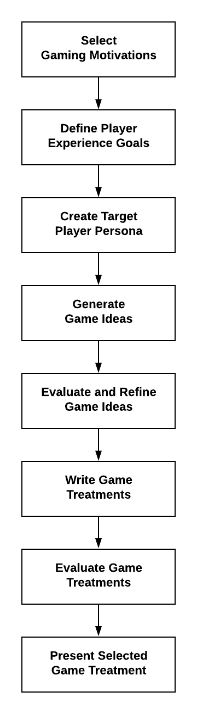

# 1 Discover & Define Problem

TK - in progress

This phase of the project will require about 6-7 weeks to complete. Your teacher will identify the specific deadline\(s\) for the task assignments.

| Task | Estimated Time | ✓ | ✓+ |
| :--- | :--- | :--- | :--- |
| 1.1 Player Motivations | 1-2 hours |  |  |
| 1.2 Incentives and Flow | 1-2 hours |  |  |
| 1.3 Game Design Elements | 1-2 hours |  |  |
| 1.4 Game Code Tutorials | 10-15 hours |  |  |
| 1.5 Target Player Persona | 1-2 hours |  |  |
| 1.6 Game Ideas | 3 hours |  |  |
| 1.7 Game Treatments | 5 hours |  |  |
| **1.8 Proposal Presentation** | 3 hours |  |  |

