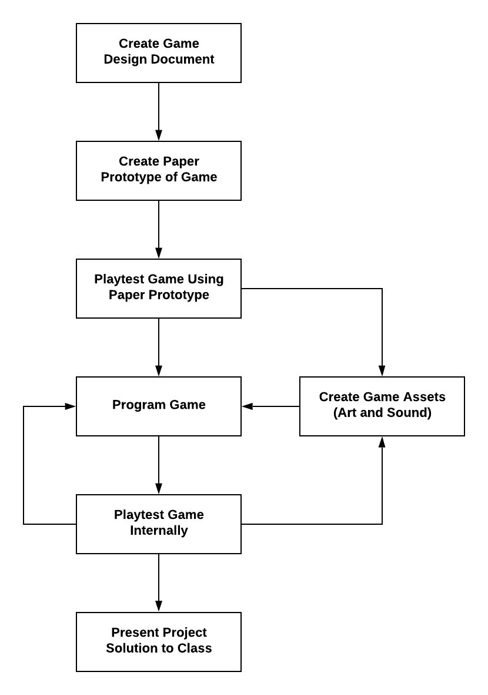

# 2.1 Project Schedule

TK - placeholder - in progress



Teams draft a project schedule for the tasks related to designing and developing their game.

### **❏ Deliverable**

Submit your team's ...



example of deliverable



| **✓- Below Standard** | **✓ Meets Standard** | **✓+ Exceeds Standard** |
| :--- | :--- | :--- |
| Description | Description | Description |



