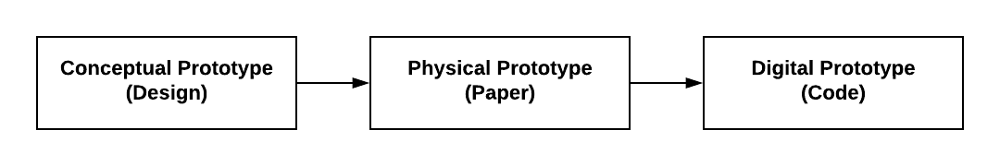

# 2.2 Game Design Document

TK - placeholder - in progress



Your team will create a game design document, which details your game's design and will help guide the prototyping and development of your game.

A game design document builds upon a game treatment by adding specifics for all the game's design elements:

* **Structural Elements** — which determine the game's mechanics
* **Dramatic Elements** — which determine the game's story
* **Artistic Elements** — which determine the game's aesthetics

The game design document will also include concept sketches for the game world, characters, and key game objects.

The game design document is a "conceptual prototype" of your game's design. Later, your team will construct and test a physical prototype of your game \(using paper\) before developing your digital prototype \(using code\).

1. Start by transferring the information from your game treatment. Your team may need \(or want\) to revise some of this information based on the feedback received in the previous assignment.
2. Brainstorm, discuss, decide, and document each of the game design elements for your team's game.

### **❏ Deliverable**

Submit your team's game design document \(including concept sketches\)



example of deliverable



| **✓- Below Standard** | **✓ Meets Standard** | **✓+ Exceeds Standard** |
| :--- | :--- | :--- |
| Description | Description | Description |



