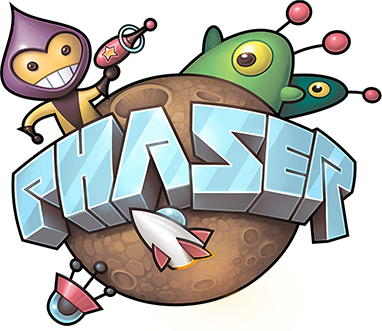

# Project Challenge



### How do we create video games that people want to play?

The class will represent a video game company that is divided into project teams. Each team will design and develop its own video game concept. The teams will help improve each other’s games through feedback and playtesting. At the end of the project, the teams will present their video game demos at a public game convention.

Each team must create a playable demo of a video game that is designed to appeal to players that have certain gaming motivations.

You'll use the [Phaser CE JavaScript game framework](https://photonstorm.github.io/phaser-ce/) to create browser-based, 2D video games. You'll use other online tools to create the game's art and sound \(such as animated character sprites, sound effects, etc.\).




Each phase of the project has a set of team deliverables, but they lead to these final deliverables from each team:

* **Video Game Demo** that is available online and ready to play
* **Project Poster** that shows how your game was created and highlights key features of the game
* **Public Presentation** that explains your game concept and allows people to play your demo game



Each team's video game must meet these design criteria:

* **Innovative:**  Your game should be unique \(can be unique remix of existing game concepts\).
* **Engaging**:  Your game should be fun and motivating to play \(i.e., match your targeted gaming motivations\).
* **Functional**:  Your game should be functional and have no major problems \(e.g., no dead ends that prevent player from progressing, etc.\).
* **Usable**:  Your game should provide clear feedback to players and be easy for a new player to learn \(e.g., learning game's controls, objectives, and rules\)
* **Balanced**:  Your game mechanics should be fine-tuned to produce desired gameplay \(e.g., balance success vs. failure, risk vs. reward, skill vs. chance, etc.\)



Each team's video game is subject to these constraints:

* Browser-based game created using Phaser CE
* 2D game world
* Single player game \(or multi-player game that uses same computer – e.g., could be turn-based game, or players could use different input keys to play at same time\)



Each team will have 2-4 members. Everyone will be a **Game Designer**, contributing to the ideas, decisions, and work related to the design of their team's game.

In addition, each team member will have at least one other specialized role:

* **Programming Lead:** leads programming of game
* **Art Lead:** leads creation of art and sound for game
* **Research Lead:** leads the playtesting and evaluation of game
* **Project Manager:** manages team to ensure project completed successfully

**Teams of 2** need to designate one person as the Programming Lead and the other person as the Art Lead. The Programming Lead will also serve as the Project Manager, while the Art Lead will also serve as the Research Lead.

**Teams of 3** need to designate different people as the Programming Lead, the Art Lead, and the Research Lead. One person \(probably the Research Lead\) will also need to serve as the Project Manager.

**Teams of 4** need to designate different people for each role.

It is highly recommended that each team agree to a set of team rules at the beginning of the project. Here is a possible [project team agreement](https://drive.google.com/open?id=11OySnAbGoev728UWsiaUk818CputNZFJ291MJNwkRwc) that could be used.



